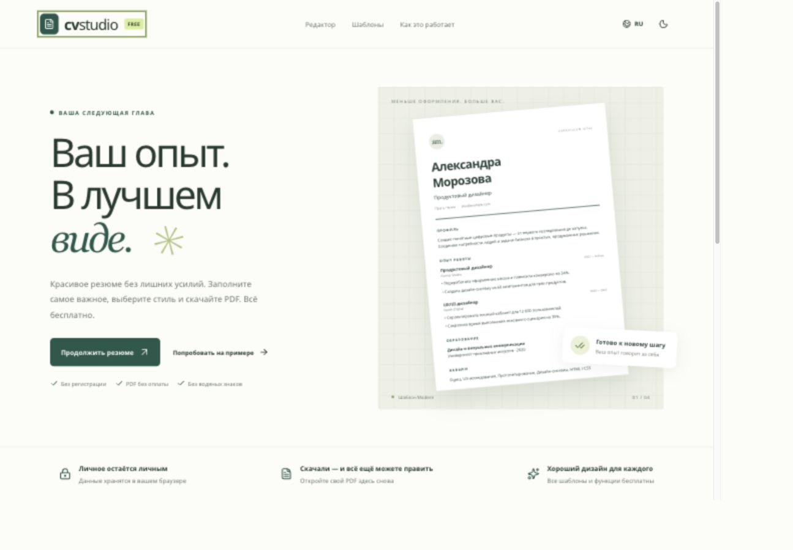

# CV Studio

A free resume editor with thoughtful templates, a live PDF preview, and no account or download paywall.

**[Open CV Studio](https://mrnednick.github.io/cv-studio/)** · [Open the editor](https://mrnednick.github.io/cv-studio/#/edit)



## What you can do

- Start with a blank resume or a fictional example.
- Edit contact details, profile, experience, education, skills, projects, and languages. Include separate portfolio, LinkedIn, and GitHub links, and an optional photo (cropped to a 4:5 portrait in the browser).
- Write with guidance in every section: short rules, a before/after example, a sentence structure for profiles and achievements, and an action-verb library that starts a new point in the entry you are editing.
- Finish with the Review step: 15 content checks (measurable results, weak openers such as “responsible for”, clichés, pronouns, dates, order, length, placeholders) with a link to the section that needs work.
- Paste a job posting to see which of its skills your resume already covers and which are missing. Synonyms and plurals count as one skill; missing ones can be added to your skills in one click. Nothing leaves the browser.
- Start in English, switch to Russian when needed, and keep your chosen language. The theme follows your device until you choose light or dark.
- Work in a desktop layout with a compact header, independently scrolling form, visible section progress, and a full-page PDF preview. Collapse the section panel to icons, switch the form to a narrow width, drag the divider, or hide the form on any tab to give the preview the whole width.
- Panels, entries, guidance, menus, and dialogs open and close with short animations. With the system’s reduced-motion setting, only gentle fades remain.
- Collapse experience, education, projects, and language entries into compact summaries, or expand them all. New entries receive keyboard focus; collapsed text remains in your PDF.
- Add, remove, and reorder entries, with undo and redo. Fast edits in different fields remain separate undo steps.
- Follow dismissible guidance for contact details, dates, empty entries, long paragraphs, and concrete achievements. Each tip opens its relevant section.
- Choose from twelve templates — Modern, Classic, Compact, Technical, Executive, Spotlight, Swiss, Timeline, Minimal, Bold, Ivy, and the two-column Editorial — plus ten accent colors, text density, and Sans, Serif, or mixed typography.
- Reorder sections or hide the ones you don’t need; hidden content is kept.
- Keep Russian and English versions together. Translations are entered manually; contact details, dates, and links are shared.
- Fit the actual A4 page to the desktop workspace and step through pages, enlarge it at 75–200% zoom, or switch to an accessible text view for reading and copying. Retry a failed preview without reloading.
- Choose a PDF for sharing (the default, selected language only) or an editable backup. Both have selectable text, embedded Cyrillic/Latin fonts, and clickable links.
- Reopen an editable PDF copy made here and continue editing. Editable copies include a `cv-studio.json` attachment containing both language versions and the design settings.
- Inspect PDF properties before downloading: author, subject, and keywords come from the selected version’s visible name, role, and skills.
- Review the name and file before importing; save a backup or cancel before replacing the current resume. Undo can restore the previous document.
- Copy the resume as plain text or download a `.txt` for online application forms.
- Import and export JSON Resume. The `cvStudio` extension preserves both language versions and presentation settings.

All templates and downloads are free. There are no watermarks, accounts, analytics, or resume uploads. Data is saved in IndexedDB on the current browser. Clearing browser data removes that local copy: keep an editable PDF or JSON backup. Sharing PDFs have no source attachment; editable copies contain both language versions and design settings, so keep those for your own use.

## Design and implementation

React 19, TypeScript, and Vite. The renderer uses `@react-pdf/renderer` for layout, `pdf-lib` to attach editable source, and PDF.js to display the same PDF in the live preview. Fonts are hosted with the app and licensed under OFL (see `public/fonts/LICENSE`). The accessible form-field primitive comes from a shared component library. Hash routes support direct editor links on GitHub Pages.

PDF code loads only when needed. The interface uses compressed WOFF2 fonts; PDF exports keep the original embedded fonts. Failed storage reads preserve the existing data and offer a retry; failed writes offer retry and JSON backup. The document supports multiple pages; empty sections stay out of the export. Single-column templates are recommended for automated screening. Editorial offers a two-column alternative. Mobile layouts switch between editing and preview; both light and dark themes keep the exported paper white.

## Readability for applications

Single-column templates keep the reading order simple. Technical places skills before work history. The editor links to [Greenhouse’s parsing guidance](https://support.greenhouse.io/hc/en-us/articles/200989175-Unsuccessful-resume-parse) and [CareerOneStop’s formatting guide](https://cloudfront.careeronestop.org/JobSearch/Resumes/ResumeGuide/formatting.aspx): use clear sections, readable text, relevant skills, and concrete experience. Match the wording of a vacancy only when it accurately describes your experience. Check the downloaded PDF and follow the employer’s requested format.

Letter spacing in every template stays below the point where PDF text extractors split words into single letters, and a test checks that headings and titles extract intact. The writing checks follow recruiter guidance summarized in [docs/research.md](docs/research.md).

The editor does not add hidden keywords, invent qualifications, or promise an ATS score. PDF metadata describes the document; it is not a ranking guarantee. Sharing exports contain only the chosen language, while editable backups contain both language versions.

## Keyboard shortcuts

In the editor, use Ctrl/⌘ Z to undo, Ctrl/⌘ Shift Z to redo, and Ctrl/⌘ S to save a JSON backup. Escape closes the document actions menu. Native dialogs support Escape to cancel.

## Development

Use Node.js 22 or later.

```sh
npm ci
npm run dev
npm test
npm run lint
npm run build
```

The development URL is `http://localhost:5173/cv-studio/`. Tests cover entry collapse/reordering/focus, duplicate imported IDs, sidebar PDF text positioning, import confirmation/cancellation and edits during file reads, storage recovery, keyboard navigation, targeted guidance, model validation, IndexedDB persistence, JSON round trips, shared contacts, undo/redo, export mode selection and retry, and PDF text, links, attachment inclusion/omission, templates, long-document pagination, typography compatibility, preview recovery, and text-view access. GitHub Actions runs lint, tests, and a production build before publishing `main` to Pages.

## Boundaries

PDF import supports editable copies exported by CV Studio (including older exports). Sharing copies, arbitrary PDFs, and scanned documents cannot be reopened for editing. JSON Resume imports use the supported sections listed above; unsupported fields are not imported. Files are limited to 10 MB, entries to 100 per section, and individual imported text values to 30,000 characters. Each browser stores one active resume; use backups for multiple documents. Vacancy matching uses a built-in skills dictionary and repeated words, not a language model, so it can miss unusual terms. There is no automatic translation or cloud sync.
