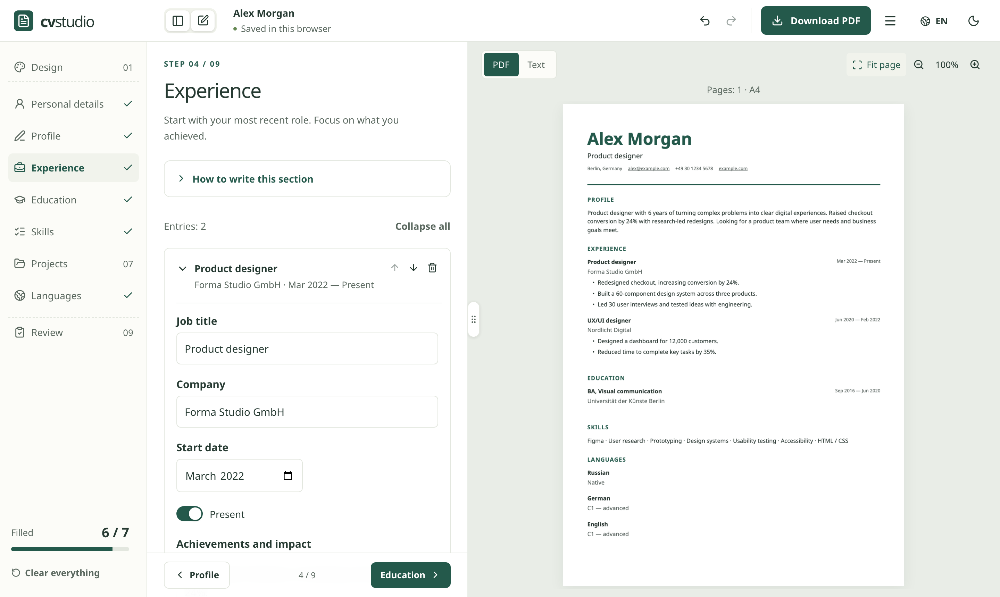

# CV Studio

A free resume editor with thoughtful templates, a live PDF preview, and no account or download paywall.

**[Open CV Studio](https://mrnednick.github.io/cv-studio/)** · [Open the editor](https://mrnednick.github.io/cv-studio/#/edit)

<picture>
  <source media="(prefers-color-scheme: dark)" srcset="docs/editor-dark.png" />
  
</picture>

## Why

Most online resume builders let you type for free and ask for a subscription when you download: Resume.io and Zety keep the PDF behind a paid plan, Novorésumé limits the free plan to one page and preset layouts ([pricing notes and sources](docs/research.md)). CV Studio keeps every template and every download free, needs no account, and stores the resume only in your browser.

The second problem is coming back later. A PDF is usually a dead end: to change one line six months from now you need the original account or the original file. CV Studio can put the source inside the PDF itself, so the file you send yourself is also the file you edit next time.

## How the editable PDF works

1. The page is laid out with `@react-pdf/renderer`, so the PDF has a real text layer: it can be selected, searched and read by applicant tracking systems, and links stay clickable. The live preview renders that same PDF with PDF.js, so what you see is what you download.
2. For an editable copy, `pdf-lib` attaches `cv-studio.json` to the PDF as an embedded file. It holds every language version and the design settings.
3. Opening that PDF in CV Studio reads the attachment back and restores the resume for editing. A sharing copy has no attachment and only the selected language.

## What you can do

- Start with a blank resume or a fictional example (a Berlin-based designer, in all six languages).
- Edit contact details, profile, experience, education, skills, projects, and languages. Include separate portfolio, LinkedIn, and GitHub links, and an optional photo (cropped to a 4:5 portrait in the browser).
- Write with guidance in every section: short rules, a before/after example, a sentence structure for profiles and achievements, and an action-verb library that starts a new point in the entry you are editing.
- Finish with the Review step: 15 content checks (measurable results, weak openers such as “responsible for”, clichés, pronouns, dates, order, length, placeholders) with a link to the section that needs work.
- Paste a job posting to see which of its skills your resume already covers and which are missing. Synonyms and plurals count as one skill; missing ones can be added to your skills in one click. Nothing leaves the browser.
- Use the interface in English, German, Spanish, Bulgarian, Ukrainian, or Russian. The theme follows your device until you choose light or dark.
- Each site language has its own version of the resume: switch the language at the top and the editor, preview, and PDF follow. Contacts, dates, and links are shared; an empty version can start as a copy of another one for translation.
- Work in a desktop layout with a compact header, independently scrolling form, visible section progress, and a full-page PDF preview. Two toolbar buttons show or hide the section list and the form; panels slide without re-wrapping their content. Drag the divider (it has a visible grip) to resize the form, as in a macOS split view: it stops at the minimum, snaps closed past it, and opens again from the edge. Double-click the divider for the default width; Ctrl/⌘ \\ toggles the form.
- Panels, entries, guidance, menus, and dialogs open and close with short animations. With the system’s reduced-motion setting, only gentle fades remain.
- Collapse experience, education, projects, and language entries into compact summaries, or expand them all. New entries receive keyboard focus; collapsed text remains in your PDF.
- Add, remove, and reorder entries, with undo and redo. Fast edits in different fields remain separate undo steps.
- Fields check themselves when you leave them: email, phone, links, and end dates show a short, specific message and a red outline (shared Field, Select, Switch, and auto-growing Textarea components).
- Follow dismissible guidance for contact details, dates, empty entries, long paragraphs, and concrete achievements. Each tip opens its relevant section.
- Design is the first step and has four panes: Template, Style (accent, five text sizes, typography, density), Sections (order and visibility), and PDF (file name, title, author, subject, keywords — empty fields come from the resume).
- Move through the steps with a fixed Back / Next footer; Review ends with the download. Delete an entry from its card, or use Clear everything under the step list — both can be undone. The example shows a banner with Start my own.
- Choose from twelve templates — Modern, Classic, Compact, Technical, Executive, Spotlight, Swiss, Timeline, Minimal, Bold, Ivy, and the two-column Editorial — plus ten accent colors, text density, and Sans, Serif, or mixed typography.
- Reorder sections or hide the ones you don’t need; hidden content is kept.
- PDF headings, dates (“Present”, “heute”, “actualidad”…), writing tips, action verbs, and the content checks follow the language of the version you edit. The built-in example exists in all six languages.
- Fit the actual A4 page to the desktop workspace and step through pages, zoom from 25% to 200%, or switch to an accessible text view for reading and copying. Retry a failed preview without reloading.
- Choose a PDF for sharing (the default, selected language only) or an editable backup. Both have selectable text, embedded Cyrillic/Latin fonts, and clickable links.
- Reopen an editable PDF copy made here and continue editing. Editable copies include a `cv-studio.json` attachment containing every language version and the design settings.
- Inspect PDF properties before downloading: author, subject, and keywords come from the selected version’s visible name, role, and skills.
- Review the name and file before importing; save a backup or cancel before replacing the current resume. Undo can restore the previous document.
- Copy the resume as plain text or download a `.txt` for online application forms.
- Import and export JSON Resume. The `cvStudio` extension preserves every language version and presentation settings.

All templates and downloads are free. There are no watermarks, accounts, analytics, or resume uploads. Data is saved in IndexedDB on the current browser. Clearing browser data removes that local copy: keep an editable PDF or JSON backup. Sharing PDFs have no source attachment; editable copies contain every language version and design settings, so keep those for your own use.

## Design and implementation

React 19, TypeScript, and Vite. The renderer uses `@react-pdf/renderer` for layout, `pdf-lib` to attach editable source, and PDF.js to display the same PDF in the live preview. Fonts are hosted with the app and licensed under OFL (see `public/fonts/LICENSE`). The accessible form-field primitive comes from a shared component library. Hash routes support direct editor links on GitHub Pages.

The home page loads first; the editor and the PDF code are separate chunks fetched when needed (the editor in the background right after the first paint). Interface fonts are WOFF2 files split into Latin, Latin Extended, and Cyrillic subsets, so a page downloads only the scripts it shows; PDF exports embed the complete TTF fonts. Failed storage reads preserve the existing data and offer a retry; failed writes offer retry and JSON backup. The document supports multiple pages; empty sections stay out of the export. Single-column templates are recommended for automated screening. Editorial offers a two-column alternative. Mobile layouts switch between editing and preview; both light and dark themes keep the exported paper white.

## Readability for applications

Single-column templates keep the reading order simple. Technical places skills before work history. The editor links to [Greenhouse’s parsing guidance](https://support.greenhouse.io/hc/en-us/articles/200989175-Unsuccessful-resume-parse) and [CareerOneStop’s formatting guide](https://cloudfront.careeronestop.org/JobSearch/Resumes/ResumeGuide/formatting.aspx): use clear sections, readable text, relevant skills, and concrete experience. Match the wording of a vacancy only when it accurately describes your experience. Check the downloaded PDF and follow the employer’s requested format.

Letter spacing in every template stays below the point where PDF text extractors split words into single letters, and a test checks that headings and titles extract intact. The writing checks follow recruiter guidance summarized in [docs/research.md](docs/research.md).

The editor does not add hidden keywords, invent qualifications, or promise an ATS score. PDF metadata describes the document; it is not a ranking guarantee. Sharing exports contain only the chosen language, while editable backups contain every language version.

## Keyboard shortcuts

In the editor, use Ctrl/⌘ Z to undo, Ctrl/⌘ Shift Z to redo, and Ctrl/⌘ S to save a JSON backup. Escape closes the document actions menu. Native dialogs support Escape to cancel.

## Development

Use Node.js 22 or later.

```sh
npm ci
npm run dev
npm test
npm run lint
npm run build
npx playwright install chromium   # once
npm run e2e                       # runs against the production build
BASE_URL=https://mrnednick.github.io/cv-studio/ npm run e2e   # or against the live site
```

The development URL is `http://localhost:5173/cv-studio/`. Tests cover entry collapse/reordering/focus, duplicate imported IDs, sidebar PDF text positioning, import confirmation/cancellation and edits during file reads, storage recovery, keyboard navigation, targeted guidance, model validation, IndexedDB persistence, JSON round trips, shared contacts, undo/redo, export mode selection and retry, and PDF text, links, attachment inclusion/omission, templates, long-document pagination, typography compatibility, preview recovery, and text-view access. Playwright end-to-end tests fill a resume from scratch and reload it, run the full download → clear → reopen the PDF → edit loop (including a renamed file without the `.pdf` extension), check that the PDF text follows the selected language, switch through all twelve templates, check the 360 px phone layout, and run axe accessibility checks on the home page and editor steps in light and dark themes. A unit test keeps every PDF text colour and accent at a contrast ratio of at least 4.5:1. GitHub Actions runs lint, unit tests, a production build, and the end-to-end suite before publishing `main` to Pages.

## Boundaries

PDF import supports editable copies exported by CV Studio (including older exports). Sharing copies, arbitrary PDFs, and scanned documents cannot be reopened for editing. JSON Resume imports use the supported sections listed above; unsupported fields are not imported. Files are limited to 10 MB, entries to 100 per section, and individual imported text values to 30,000 characters. Each browser stores one active resume; use backups for multiple documents. Vacancy matching uses a built-in skills dictionary and repeated words, not a language model, so it can miss unusual terms. There is no automatic translation or cloud sync.

## Translations

Russian and English interface text lives next to the code; German, Spanish, Bulgarian, and Ukrainian are in `src/locales/`, keyed by the English text. `node scripts/i18n-keys.mjs` lists every string that needs a translation, and a test fails when a dictionary misses one, keeps a stale one, or changes a `{placeholder}`.
