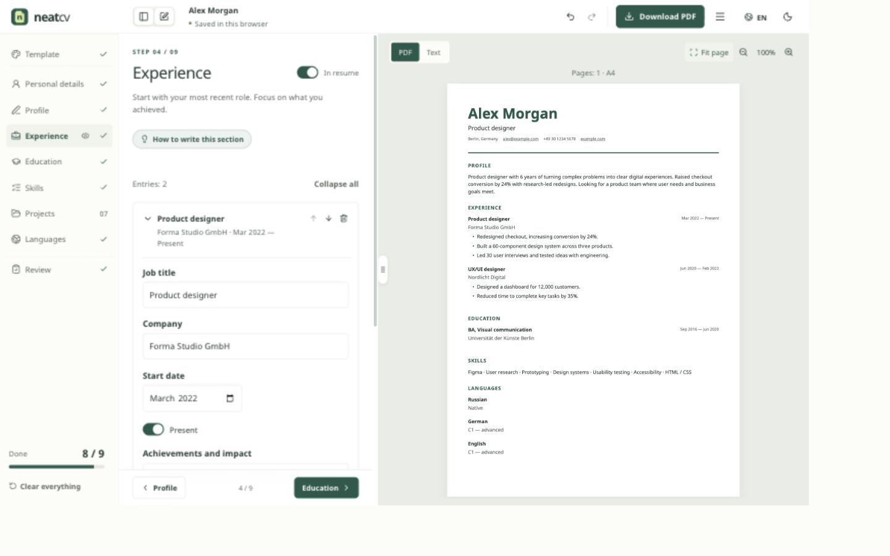

# NeatCV

A free resume editor with a live PDF preview and editable backups. Built by [Nikita Nedyalkov](https://www.linkedin.com/in/mrnednick/).

**[Open NeatCV](https://neatcv.cc/)** · [Try the editor](https://neatcv.cc/#/edit) · [Privacy](https://neatcv.cc/privacy.html)

<picture>
  <source media="(prefers-color-scheme: dark)" srcset="docs/editor-dark.jpg" />
  
</picture>

## The problem

A resume needs to be easy to write, readable when exported and easy to update later. A payment screen at the download step interrupts that work. A PDF without its source makes the next edit harder: the person has to find an old account, recover a document or start over.

NeatCV is a personal project built around three constraints: the complete editing and download flow is free, resume content stays in the browser, and a downloaded backup can be reopened without an account. There is no paid tier, subscription, watermark or resume upload. The [author block on the home page](https://neatcv.cc/) explains who made it and why it is free.

## The result

Start with a blank resume or a fictional example, fill in the sections, choose a template and download a PDF. The preview uses the same PDF as the export. Changes save locally; returning to the editor restores the current document.

- Twelve templates, accent and typography controls, optional photo cropping and a live A4 preview.
- English, German, Spanish, Bulgarian, Ukrainian and Russian interfaces. Each language has its own resume text; contacts, dates and links are shared.
- Writing examples, a voluntary floating walkthrough, review checks and local matching against a pasted job posting.
- Accessible text preview and a check of the generated PDF’s selectable text and links.
- Sharing PDF, editable PDF, JSON Resume backup and plain-text export.
- Responsive editing, undo/redo, keyboard shortcuts, both themes and reduced-motion support.
- Recovery after storage or preview errors, with retry and backup actions.

## The key design decision: two PDFs

A sharing PDF contains the selected language and no source attachment. An editable PDF includes `neatcv.json`: every language version and the design settings, including content hidden from the sharing PDF. This keeps a private backup useful without adding hidden material to the file sent to an employer.

The reopen flow is deliberately explicit: review the file, save a backup of the current resume if needed, then replace it. Import cancellation leaves the current document in place, and undo can restore the previous one.

## Implementation choices

| Constraint                                              | Choice                                                                                       | What it gives the person using it                                   |
| ------------------------------------------------------- | -------------------------------------------------------------------------------------------- | ------------------------------------------------------------------- |
| No resume account or upload                             | IndexedDB, with local browser preferences                                                    | Editing and persistence without a server round trip                 |
| Preview matches the download                            | `@react-pdf/renderer` generates the PDF; PDF.js displays it                                  | The same layout in the editor and the exported file                 |
| Backups work independently of accounts                  | `pdf-lib` embeds the JSON source in editable PDFs                                            | Reopen, edit and export from the file itself                        |
| Six languages without translating a resume unexpectedly | Separate text versions and dictionaries loaded on demand                                     | A chosen interface language, with independent resume wording        |
| Stable desktop and phone editing                        | Resizable panels, preserved scrollbars, interruptible transitions and mobile step navigation | Panels and controls stay usable while the layout changes            |
| Private content stays private                           | Local processing and an explicit telemetry allowlist                                         | Optional measurements can exclude resume fields, files and contacts |

React 19, TypeScript and Vite run the interface. Fonts are hosted with the app and licensed under OFL. The editor and PDF code load as separate chunks. The privacy notice has its own entry point and does not open the resume database.

## Evidence and limits

[GitHub Actions](https://github.com/MrNedNick/cv-studio/actions) runs types, unit tests, a fresh production build and browser scenarios before publishing to GitHub Pages. The checks cover editing and reload, PDF download → reopen → edit, JSON round trips, all templates and languages, blocked storage, interrupted transitions, keyboard focus and axe accessibility checks in both themes.

Browser coverage includes desktop Chromium, phone Chromium and an iPhone WebKit profile, narrow and landscape layouts, and simulated keyboard viewport changes. These profiles do not replace testing on a physical iPhone or with a real screen reader. PDF text and link inspection is a practical check, not an ATS certification.

There is one active resume per browser; keep backups for multiple documents. PDF import reads editable NeatCV copies, not arbitrary or scanned PDFs. Imports are limited to 10 MB, 100 entries per section and 30,000 characters per text value. Vacancy matching uses a fixed skills dictionary and can miss unusual terms. There is no automatic translation or cloud sync.

## Privacy and operation

Resume content, photos, imports and PDF creation stay local. Clearing site data removes the browser copy; downloaded backups remain on the device.

Source links such as `?ref=reddit` retain first/latest attribution for 30 days, separately from the resume. Umami analytics is optional and disabled without a website ID. Sentry diagnostics is prepared and disabled without a valid public browser DSN; error messages, resume fields, breadcrumbs and attachments are excluded. GitHub Pages logs visitor IP addresses for security. Current behavior and service status are described in the [privacy notice](https://neatcv.cc/privacy.html), [source-label table](docs/sources.md), [Sentry setup and filtering](docs/sentry.md) and [service activation requirements](docs/privacy.md).

The home page in six languages, [template gallery](https://neatcv.cc/templates/), twelve template pages and [help with FAQ](https://neatcv.cc/help/) are rendered to HTML during the build. They remain readable without JavaScript; React attaches to that same content to enable editing. Each language home has its own canonical URL, translated metadata and reciprocal language links. The [sitemap](https://neatcv.cc/sitemap.xml) includes these twenty pages and the privacy notice. The editor requires JavaScript.

PDF fonts use a smaller checked-in core for Latin, Greek and Cyrillic text, retaining the complete fonts when a visible character needs wider coverage. The four core files total 1.05 MB instead of 2.40 MB, with unchanged glyph widths. The editor loads during idle time on a normal connection; data saver, slow 2G, offline and hidden pages skip this optional preload. [Public pages and loading](docs/public-pages.md) describes the routes and checks.

[Search Console and Bing setup](docs/search-console.md) gives the domain verification and sitemap submission steps. Account verification requires the owner's provider-issued DNS value; sitemap availability alone does not mean the site is verified or indexed.

## Run and verify

Use Node.js 22.12 or a newer supported LTS release.

```sh
npm ci
npm run dev
npm run lint
npm test
npm run build
npx playwright install chromium webkit   # once
npm run e2e                             # against the fresh build
BASE_URL=https://neatcv.cc/ npm run e2e   # against the deployed site
```

Development runs at `http://localhost:5173/`. The [component gallery](https://neatcv.cc/components.html) uses temporary state without saved resumes. Ctrl/⌘ Z undoes an edit, Ctrl/⌘ Shift Z redoes it, and Ctrl/⌘ S downloads a JSON backup.

Russian and English copy lives next to the code; the other four dictionaries are in `src/locales/`. `node scripts/i18n-keys.mjs` collects interface strings. Tests reject missing or stale translations and altered placeholders.

Further reading: [writing and PDF research](docs/research.md), [onboarding](docs/onboarding.md), [components](docs/components.md), [brand](docs/brand.md) and [roadmap](docs/roadmap.md).
